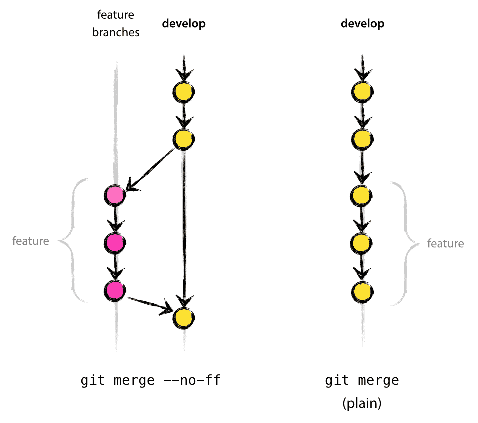

# Wprowadzenie do GIT

## 1. Podstawowe informacje  
opracowanie: dr inż. J.Bułat

GIT jest rozproszonym systemem kontroli wersji.
Pozwala on działać bez połączenia sieciowego, możliwe jest tworzenie depozytoriów lokalnych zawierających wszelkie gałęzie, pełną historie rewizji itp.  
Możliwe jest również tworzenie wielu repozytoriów centralnych.

  
[source](https://iedf.in/index.php/learn/courses/68-introduction-to-git-github)

  
[source](http://nvie.com/posts/a-successful-git-branching-model/)

## 2. GIT podstawowe komendy 

1. Tworzenie lokalnego repozytorium i pobranie plików z repozytorium zdalnego do lokalnego: 
`git clone https://github.com/MiTPMaPT/MiTP_II_19_20`

2. `git add .` - dodawanie plików do lokalnego repozytorium, 

3. `git commit -am krotki komentarz ` - zatwierdzenie zmiany w pliku + opis/komentarz do wprowadzonej zmiany/rewizji 

4. `git push` przenoszenie plików do zdalnego repozytorium (uaktualnia pliki po stronie repozytorium zdalnego)

5. `git pull` pobieranie plików z  repozytorium  zdalnego do lokalnego (bieżącej gałęzi). Musi być wykonywany z katalogu git, w tym przypadku `MiTP`.  
 `git pull - all` ściąga wszystkie gałęzie

6. `git branch -a` pokazuje wszystkie dostępne (istniejące w danym repozytorium) gałęzie  
`git branch -r` pokazuje tylko gałęzie dostępne zdalnie  
`git branch -a` zdalnie i lokalnie (wszystkie)

7. ` git checkout other_branch` zmiana gałęzi na `other_branch` 
Przełączenie z gałęzi X na gałąź Y spowoduje zastąpienie plików z gałęzi X  plikami z gałęzi Y. 
Git odmawia zastępowania plików w których nie zatwierdzono dokonanych zmian. 
Git nie zmienia żadnych niezatwierdzonych plików (nie dodanych ani nie wymienionych w pliku `.gitignore`)

8. `git checkout -b new_branch` utworzenie nowej gałęzi (lokalnie)
w oparciu o bieżącą gałąź
`touch something`  
`git add .`dodawanie pliku do repozytorium/ aktualizacja plików do śledzenia  
`git commit -am "krotki komentarz"`  
`git push -u origin new_branch` tylko przy pierwszym użyciu (wysyłaniu), przy kolejnych samo` git push`

9. usuwanie plików z repozytorium:
`rm something.txt`  
`git add .` dodawanie pliku do repozytorium/ aktualizacja plików do śledzenia
`git commit -am "usunięcię something"`  
`git push`  

10. `git status` pokazuje status repozytorium lokalnego,
wyświetla nieśledzone pliki

11. `git log -3` pokazuje ostatnie 3 zatwierdzenia/ uaktualnienia

12. `git merge master ` łączenie dwóch gałęzi,
Przykładowo: importowanie głównej gałęzi (lokalnej) do bieżącej (aktualnie modyfikowanej) gałęzi (lokalnej). 
Bieżąca (aktualnie modyfikowana) gałąź może być gałęzią główną lub inną. 
Łączenie nie zmienia niczego w repozytorium zdalnym. 
Scalanie odbywa się automatycznie, o ile nie wystąpią konflikty. 
Konflikt oznacza, że np. użytkownik B zmienił tę samą linię, którą w międzyczasie zmienił użytkownik A. 
Git zaznacza tę linię w kodzie, przestawia obie wersje pliku i czeka na decyzję którą linię uznać za prawidłową.

13. `git fetch` pobieranie informacji (nie plików) ze źródła (`origin`, domyślna nazwa którą Git nadaje serwerowi z którego klonowany jest projekt), żaden plik nie zostanie zmieniony w repozytorium lokalnym ani zdalnym

14. `git reset --hard` rezygnacja z modyfikacji i powrót do postaci źródła (np.`git clone .... `)

15. plik `.gitignore`, spis plików które powinny być ignorowane, np .:
`*.tmp` w `.gitignore` oznacza, że wszystkie pliki "tymczasowe" w tym katalogu zostaną zignorowane przez git.
Na przykład plik o nazwie README.md.tmp nie będzie dodawany do repozytorium po wykonaniu komendy  `git add.`. Innymi słowy, git zignoruje ten plik i nie wykona żadnych działań na nim.

16. Przywracanie usuniętego pliku (kasowanie historii): jeśli plik usunięto lub zmieniono go (dawno temu), można go przywrócić, ponieważ wszystkie zmiany są śledzone w repozytorium. 
Aby zobaczyć ostatnie aktualizacje użyj komendy `git log`.

## 3. GIT w przykładach
### tworzenie lokalnego repozytorium git (klonowanie ze zdalnego)
`git clone https://github.com/MiTPMaPT/MiTP_II_19_20`  - ustawienie lokalnego repozytorium i pobranie plików z repozytorium zdalnego do lokalnego:  
`cd MiTP`  
`git config --global user.name "nazwa użytkownika" ` **przy pierwszym logowaniu należy skonfigurować git: podać adres e-mail**  
`git config --global user.email your@mail.com` **w laboratorium MiTP trzeba podać hasło/nazwę i adres e-mail użytkownika po każdym uruchomieniu systemu, ponieważ katalog domowy jest usuwany przy zamykaniu systemu i wszystkie informacje (w tym ustawienia git ) są usuwane**  
`git config --globally push.default simple` ustawienie metody wysyłania `simple` (bezpieczna)  
`git config --global credential.helper" cache --timeout = 3600 "` git będzie pamiętał login / hasło przez 3600 sekund po pierwszym logowaniu

### zmiana/modyfikacja pliku w istniejącym repozytorium lokalnym
`cd git/MiTP_II_19_20/` założenie: git jest skonfigurowany (patrz powyżej) a repozytorium jest sklonowane
`git pull` pobranie najnowszych plików z repozytorium zdalnego do lokalnego (tzw. **HEAD**)
Właściwa zmiana/modyfikacja pliku w repozytorium lokalnym, np. `vim README.md`
`git commit -am "nowy komentarz"` zapisywanie zmiany w repozytorium + komentarz
`git push`  wysłanie na serwer zdalny

### dodawanie nowego pliku do repozytorium
`cd git/MiTP_II_19_20/` założenie: git jest skonfigurowany (patrz powyżej) a repozytorium jest sklonowane. <br\> Właściwe dodanie nowego pliku w katalogu `MiTP`, np .:`vim new_file.txt`
`git add .` aktualizacja stanu plików (np. dodanie nowych plików do śledzenia)  
`git commit -am "nowe pliki lub podobny opis" `zapisywanie zmian w repozytorium + komentarz  
`git push` wysłanie na serwer zdalny

### usuwanie plików / katalogów z repozytorium
`cd git/MiTP_II_19_20/` założenie: git jest skonfigurowany (patrz powyżej) a repozytorium jest sklonowane
Właściwe usuniecie pliku/katalogu: `rm -rf lab_02/`  
`git add . `aktualizacja stanu plików (np. usunięcie z listy plików do śledzenia)  
`git commit -am "usuniete pliki lub podobny opis"`zapisywanie zmiany w repozytorium + komentarz 
`git push`  

### przełączanie gałęzi
`cd git/MiTP/` założenie: git jest skonfigurowany (patrz powyżej) a repozytorium jest sklonowane  
`git branch -a` (opcjonalnie) pokaż wszystkie dostępne gałęzie, lokalne i zdalne
przykładowe wyjście :  
>>* master  
>>remotes/origin/branch123    
>>remotes/origin/common  

oznacza: dostępna jedna lokalna gałąź o nazwie `master` i dwie zdalne gałęzie: `branch123` oraz `common` 
 
`git checkout common` przełączenie gałęzi na `common`  
* jeśli `common` jest w repozytorium lokalnym,  git zmienia go i nie zastępuje go ostatnią wersją (poprzez `pull`) z repozytorium zdalnego
* jeśli `common` jest w repozytorium zdalnym (nie trzeba wpisywać` git checkout remotes / origin / common`),  git tworzy nową gałąź i ściąga (`pull`) ostatnią wersję z serwera

### tworzenie nowej gałęzi
`cd git/MiTP/` założenie: git jest skonfigurowany (patrz powyżej) a repozytorium jest sklonowane  
`git branch -a` (opcjonalnie), aby upewnić się, że nazwa nowej gałęzi nie jest już używana  
`git checkout parent_branch` (opcjonalnie) przejście do gałęzi, która będzie rodzicem nowej gałęzi   
`git checkout -b my_branch` utworzenie nowej gałęzi o nazwie` my_branch`,  gałąź zostanie utworzona tylko lokalnie! gałęzią macierzystą będzie `parent_branch`  
`git add .` opcjonalnie, jeśli chce się coś dodać  
`git commit -am "jakis komentarz"` zapisywanie zmiany w repozytorium + komentarz  
`git push -u origin my_branch` wysyłanie lokalnej gałęzi o nazwie `my_branch` na zdalne repozytorium o nazwie `my_branch`; taka konstrukcja jest obowiązkowa tylko wtedy,  gdy gałąź po raz pierwszy jest umieszczana na serwerze zdalnym, za każdym następnym razem wystarczy tylko `git push`   

## 4. Ćwiczenia

Otwórz terminal, utwórz katalog `git` i wejdź do niego (`cd git`).  
**Jest dobrą praktyką posiadanie osobnych katalogów dedykowanych dla poszczególnych repozytoriów git.**

#### EX4.1: tworzenie gałęzi
1. Utwórz własną gałąź
2. Utwórz plik tekstowy zawierający Twoje imię jako treść
3. Prześlij (`push`) gałąź do zdalnego repozytorium
4. Sprawdź zdalnie (przez WWW) zawartość tego pliku
5. Poproś kolegę (obok ciebie), aby sprawdził Twoją gałąź i zawartość pliku

#### EX4.2: próba pobierania wersji bez wcześniejszego zatwierdzania (`commit`) i wysłania wersji (`push`)
1. Pobierz (`pull`) wersję projektu z repozytorium zdalnego
2. Dokonaj zmian w lokalnej kopii pliku tekstowego
3. Spróbuj ponownie pobrać  (`pull`) wersję projektu z repozytorium zdalnego 
Komentarz: git nie pozwoli nadpisać plików zmodyfikowanych lokalnie ich starszymi wersjami z repozytorium zdalnego)

#### EX4.3: próba pobrania bez wcześniejszego wysłania
1. Pobierz (`pull`) wersję projektu z repozytorium zdalnego
2. Dokonaj zmian w lokalnej kopii pliku tekstowego
3. Zatwierdź (`commit`) zmiany 
4. Umieść (`push`) wersję projektu w repozytorium zdalnym
Komentarze: sytuacja analogiczna do EX4.2

#### EX4.4: poprawne umieszczanie wersji
1. Pobierz (`pull`) wersję projektu z repozytorium zdalnego
2. Dokonaj zmian w lokalnej kopii pliku tekstowego
3. Zatwierdź (`commit`) zmiany 
4. Umieść (`push`) wersję projektu w repozytorium zdalnym
5. Sprawdź zawartość tego pliku przez WWW

#### EX4.5: status 
Powtórz ćwiczenia 4.2 do 4.4 wpisując komendę `git status` przed  pobieraniem wersji z repozytorium zdalnego (`pull`)

#### EX4.6: próba umieszczanie wersji podczas modyfikacji pliku w repozytorium zdalnym
1. Pobierz plik z repozytorium zdalnego
2. Dokonaj zmian w lokalnej kopii pliku X
3. Zatwierdź zmiany w pliku
4. Dokonaj zmian w pliku X w zdalnym repozytorium (poproś o kolegę o zrobienie tego)
5. Umieść wersję projektu

  
Komentarz: Próba zastąpienia nowszych plików (na zdalnym repozytorium) starszymi (z lokalnego repozytorium). Git nie pozwala tego zrobić. Sugeruje pobranie wersji pliku ze zdalnego repozytorium, aby dokonać łączenia z wersją z lokalnego repozytorium i tak połączone repozytorium wysłać ponownie do repozytorium zdalnego.

### EX4.7 próba przełączenia się z niezatwierdzonej gałęzi
1. Pobierz wersję projektu repozytorium zdalnego gałęzi X
2. Dokonaj zmian w lokalnym pliku X
3. Przełącz się na gałąź Y. 

  
Komentarz: Nie zatwierdzono zmian (i nie będą one śledzone) przy jednoczesnej próbie przełączenia gałęzi.  
Grozi to utratą dokonanych zmian - git odmawia wykonania takiego polecenia.  
Przed przełączeniem się na nową gałąź muszą zostać zatwierdzone zmiany w gałęzi aktualnie modyfikowanej.  
Umieszczanie zmian na serwerze zdalnym nie jest jednak konieczne przed dokonaniem przełączenia.

## 5. Narzędzia i odnośniki

**Narzędzia**:
* git (narzędzie linii poleceń) <=== najważniejsze do nauczenia
* Eclipse IDE (łączenie z repozytoriami Git za pośrednictwem wtyczki)
* CLion IDE - natywny
* Code :: Blocks IDE (brak obsługi Git)
* WWW (github / GitLab)
* gitg (interfejs GTK +)

**Odnośniki**:
* [trygit](https://try.github.io)  krótki kurs git
* [git guide #1](http://rogerdudler.github.io/git-guide/)
